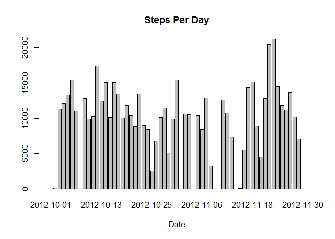
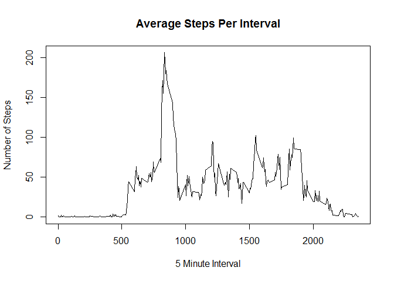

# Reproducible Research: Peer Assessment 1


## Loading and preprocessing the data
Load the activity.csv file (a comma delimited file).  This assumes the file has 
already been upzipped and is in your working directory.

Run a quick summary to look at the data & view the first few rows.


```r
activity <- read.csv(file="activity.csv", sep=",")
summary(activity)
```

```
##      steps                date          interval     
##  Min.   :  0.00   2012-10-01:  288   Min.   :   0.0  
##  1st Qu.:  0.00   2012-10-02:  288   1st Qu.: 588.8  
##  Median :  0.00   2012-10-03:  288   Median :1177.5  
##  Mean   : 37.38   2012-10-04:  288   Mean   :1177.5  
##  3rd Qu.: 12.00   2012-10-05:  288   3rd Qu.:1766.2  
##  Max.   :806.00   2012-10-06:  288   Max.   :2355.0  
##  NA's   :2304     (Other)   :15840
```

```r
head(activity)
```

```
##   steps       date interval
## 1    NA 2012-10-01        0
## 2    NA 2012-10-01        5
## 3    NA 2012-10-01       10
## 4    NA 2012-10-01       15
## 5    NA 2012-10-01       20
## 6    NA 2012-10-01       25
```

## What is mean total number of steps taken per day?

In order to find the mean total number of steps taken per day, we need to create
a data frame StepsPerDay which is the sum of steps per day; then get the mean of
those values.

- Make a Histogram of the total number of steps taken each day

We will use an load the ggplot2 library.


```r
#Create dataframe:
StepsPerDay <- setNames(aggregate(activity$steps, by=list(activity$date),
                                  FUN=sum, na.rm=TRUE), c("Dt", "TotalSteps"))

#histogram:
library(ggplot2)
barplot(StepsPerDay$TotalSteps, main="Steps Per Day", xlab="Date", names.arg = StepsPerDay$Dt)
```

<!-- -->

- Calculate and report the mean and median total number of steps taken per day


```r
TotalDailyMean <- mean(StepsPerDay$TotalSteps)
TotalDailyMean
```

```
## [1] 9354.23
```

```r
TotalDailyMedian <- median(StepsPerDay$TotalSteps)
TotalDailyMedian
```

```
## [1] 10395
```


## What is the average daily activity pattern?

- Make a time series plot (i.e. type = "l") of the 5-minute interval (x-axis) 
and the average number of steps taken, averaged across all days (y-axis)

To do this, we'll create a new dataset, based on INTERVAL instead of date.


```r
#create dataframe
StepsPerInterval <- setNames(aggregate(activity$steps, 
        by=list(activity$interval), FUN=mean, na.rm=TRUE), 
        c("Interval", "AvgSteps"))

#plot it
plot(AvgSteps ~ Interval, data=StepsPerInterval, 
     main="Average Steps Per Interval", xlab="5 Minute Interval", 
     ylab="Number of Steps", type="l")
```

<!-- -->

- Which 5-minute interval, on average across all the days in the dataset, 
contains the maximum number of steps?


```r
StepsPerInterval[ which.max(StepsPerInterval$AvgSteps),]
```

```
##     Interval AvgSteps
## 104      835 206.1698
```

## Imputing missing values

- Calculate and report the total number of missing values in the dataset (i.e. 
the total number of rows with NAs)

From the base dataframe (activity), find how many values are NA in each of the
3 original columns, but display only columns that have missing.


```r
Missing <- sapply(activity, function(x) sum(is.na(x)))
Missing[Missing>0]
```

```
## steps 
##  2304
```

- Devise a strategy for filling in all of the missing values in the dataset. The strategy does not need to be sophisticated. For example, you could use the mean/
median for that day, or the mean for that 5-minute interval, etc.

We'll just put in the Mean for that 5 minute interval, that we already know in 
the StepsPerInterval dataset.

- Create a new dataset that is equal to the original dataset but with the 
missing data filled in.


```r
#copy existing data
ImpActivity <- activity
#rename the interval to Interval so we can join
names(ImpActivity)[names(ImpActivity)=="interval"]<-"Interval"
#overwrite dataframe but include the results of the join
ImpActivity<-merge(ImpActivity, StepsPerInterval, by="Interval" )
#update steps where they are NA to the average
ImpActivity$steps[is.na(ImpActivity$steps)] <- ImpActivity$AvgSteps[is.na(ImpActivity$steps)]
```

- Make a histogram of the total number of steps taken each day and Calculate and report the mean and median total number of steps taken per day. Do these values 
differ from the estimates from the first part of the assignment? What is the 
impact of imputing missing data on the estimates of the total daily number of 
steps?

```r
#Create dataframe:
ImpStepsPerDay <- setNames(aggregate(ImpActivity$steps, by=list(ImpActivity$date),
                                  FUN=sum, na.rm=TRUE), c("Dt", "TotalSteps"))

#plot it
barplot(ImpStepsPerDay$TotalSteps, main="Steps Per Day (Imputed)", xlab="Date", names.arg = ImpStepsPerDay$Dt)
```

<!-- -->

```r
#mean/median
TotalImpDailyMean <- mean(ImpStepsPerDay$TotalSteps)
TotalImpDailyMean
```

```
## [1] 10766.19
```

```r
TotalImpDailyMedian <- median(ImpStepsPerDay$TotalSteps)
TotalImpDailyMedian
```

```
## [1] 10766.19
```

```r
#Differences:
#create dataset to line up the differences:
DiffActivity<-merge(ImpStepsPerDay, StepsPerDay, by="Dt" )
#rename totalstep columns:
names(DiffActivity)[names(DiffActivity)=="TotalSteps.x"]<-"ImpTotalSteps"
names(DiffActivity)[names(DiffActivity)=="TotalSteps.y"]<-"OrigTotalSteps"

#show rows where there are differences:
DiffActivity[DiffActivity$ImpTotalSteps != DiffActivity$OrigTotalSteps,]
```

```
##            Dt ImpTotalSteps OrigTotalSteps
## 1  2012-10-01      10766.19              0
## 8  2012-10-08      10766.19              0
## 32 2012-11-01      10766.19              0
## 35 2012-11-04      10766.19              0
## 40 2012-11-09      10766.19              0
## 41 2012-11-10      10766.19              0
## 45 2012-11-14      10766.19              0
## 61 2012-11-30      10766.19              0
```


## Are there differences in activity patterns between weekdays and weekends?

- Create a new factor variable in the dataset with two levels -- "weekday" and "weekend" indicating whether a given date is a weekday or weekend day.

*assumes the package timeDate has been installed*


```r
#we need a library
library(timeDate)
#copy original dataframe:

TypeOfDay<-activity
#ensure date is a date!
TypeOfDay$date<-as.POSIXct(TypeOfDay$date)
DayTypeFactor <- as.factor(c("weekend", "weekday"))


TypeOfDay$IsWeekday<-isWeekday(TypeOfDay$date, wday=1:5)
#set all to "weekend"
TypeOfDay$DayType<-"weekend"
TypeOfDay$DayType[TypeOfDay$IsWeekday==TRUE]<-"weekday"

table(TypeOfDay$DayType)
```

```
## 
## weekday weekend 
##   12960    4608
```


- Make a panel plot containing a time series plot (i.e. type = "l") of the 5-minute interval (x-axis) and the average number of steps taken, averaged across all weekday days or weekend days (y-axis). 


```r
#reformat as we want:
TypeOfDay <- aggregate(TypeOfDay$steps ~ TypeOfDay$interval + TypeOfDay$DayType, TypeOfDay, mean)
#clean names
names(TypeOfDay)<- c("interval", "daytype", "steps")
 

#plot it
par(mfrow=c(1,1))  
with(TypeOfDay, plot(steps ~ interval, type="n", main="Weekday and Weekend Average By Interval"))  
with(TypeOfDay[TypeOfDay$daytype ==  "weekday",], lines(steps ~ interval, type="l", col="black"))  
with(TypeOfDay[TypeOfDay$daytype == "weekend",], lines(steps ~ interval, type="l", col="red" ))  
legend("topright", lty=c(1,1), col = c("black", "red"), legend = c("weekday", "weekend"), seg.len=3)
```

<!-- -->
